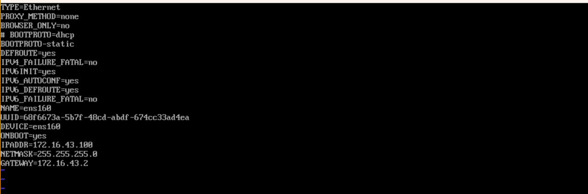

# Windows 安装 ubuntu 虚拟机

见我的知乎文章


安装虚拟机


补一些问题：

1. 虚拟机屏幕无法适应，要安装 vmware tools，可以手动，可以自动，自动如下（要先换源，不然由于维护软件包，无法安装）

```bash
sudo apt install open-vm-tools-desktop -y
sudo reboot
```

2. 虚拟机改代理，前面的数字为主机 ipconfig 下的 ip ，端口为本机代理端口

<figure><figcaption><p>代理</p></figcaption></figure>

3. 安装界面太小，按 alt+f7 加鼠标滚轮调动
