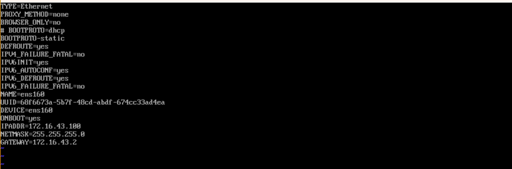

# Mac m1 安装 centos 虚拟机

M1 需要下载 centos arm 架构的server 镜像，在百度网盘，有需要的请发邮件吧

Vmware Flusion


虚拟机


下载之后拖进去安装即可，需要申请一个序列号

遇到的问题：

1. **ping:** [**www.baidu.com**](http://www.baidu.com)**: Name or service not known**

```
第一步：
sudo vim /etc/sysconfig/network-scripts/ifcfg-ens33
ONBOOT=no # 改为 yes
第二步：
sudo vim /etc/resolv.conf
检查文件内是否正确配置了 DNS，没有正确配置可以添加如下代码： 
nameserver 8.8.8.8 nameserver 8.8.4.4
```

2. **配置静态ip**

```bash
cat /Library/Preferences/VMware\\ Fusion/vmnet8/nat.conf

# 设置与自己本机同一网段
# NAT gateway address
ip = 172.16.43.2
netmask = 255.255.255.0
```

<figure><figcaption><p>static ip</p></figcaption></figure>
